# Deloitte Digital Democracy Survey — Streaming Subscription Prediction

End-to-end data science project across **5 phases** — merging and cleaning 3 survey waves (6,412 US consumers, 2015–2017), 17-block EDA, K-Means customer segmentation (4 personas), and a 5-model classification pipeline. Random Forest emerged as the best model with **ROC-AUC 0.861 and F1 0.739**, predicting whether a consumer will subscribe to streaming video using only behavioral signals.

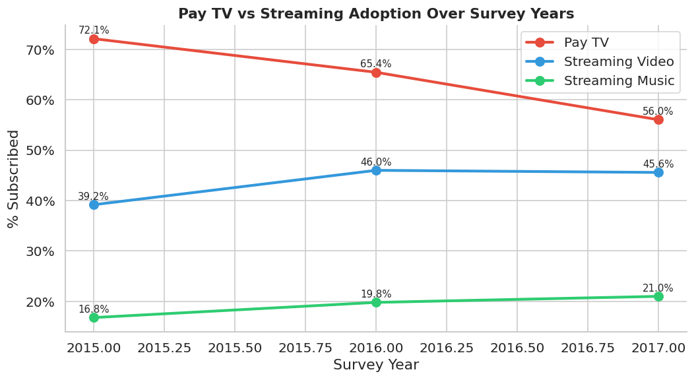

> **Core insight:** Pay TV fell from 71% → 65% while streaming grew from 42% → 52% between 2015 and 2017 — a measurable, data-backed cord-cutting trend confirmed within the dataset itself.

---

## Business Problem

The US streaming video market had a central commercial challenge in the mid-2010s: a massive addressable population of non-subscribers already paying for home internet. The question was not whether streaming would grow — it was *who* to target, *how* to approach them differently, and *whether subscription behavior was predictable enough to model*.

This project addresses two core hypotheses:

1. **Segmentation Hypothesis:** US consumers do not form a homogeneous market. Distinct behavioral groups exist, differing meaningfully in device ownership, app usage, age, income, and media consumption patterns — large enough that K-Means clustering will produce coherent, business-actionable personas.

2. **Prediction Hypothesis:** Whether a consumer subscribes to streaming video is systematically related to observable behavioral signals. A supervised classifier trained on these signals will generalize to new data and be deployable for targeted acquisition campaigns.

**Both hypotheses were confirmed.**

## Dataset

- **Source:** Deloitte Digital Democracy Survey (DDS), Waves 9, 10, and 11
- **Coverage:** US consumers with home internet access, 2015, 2016, 2017
- **Final shape:** 6,412 respondents after cleaning
- **Raw files:** Three separate Excel files (`DDS9`, `DDS10`, `DDS11`) with different column naming conventions and partially overlapping question sets
- **Feature types:** Device ownership (binary), subscription status (binary), app usage (binary), media consumption percentages by device (0–100), Likert attitude scores (1–4), frequency scores (1–4), willingness-to-pay, demographics

---

## The Full Pipeline

### Phase 1 — Loading & Merging Three Survey Waves

**The problem:** Three separate Excel files, each with slightly different column names for equivalent questions, and different question sets asked across waves.

**Step 1 — Load all three waves:**
```python
dds9  = pd.read_excel('DDS9_Data_Extract_with_labels.xlsx')
dds10 = pd.read_excel('DDS10_Data_Extract_with_labels.xlsx')
dds11 = pd.read_excel('DDS11_Data_Extract_with_labels.xlsx')
```

**Step 2 — Identify column differences across waves:**

Before renaming, I mapped which columns were:
- Present in all 3 waves (core columns → keep as-is)
- Present in only 1 or 2 waves (wave-specific → keep but annotate)

Built a `col_availability` metadata DataFrame to document this systematically.

**Step 3 — Standardize column names via rename maps:**

Several columns represented the same question but with different wording or codes across waves. A rename map was applied per wave:

| Issue | DDS9 name | DDS10/11 name | Canonical name |
|---|---|---|---|
| Survey weight | `wg` | `Final Weighting` / `FINAL WEIGHTS` | `weight` |
| App question device phrasing | `...smartphone and/or tablet?` | `...smartphone?` | standardized |
| TV watching phrasing (Q37r3) | `Watching television (on any device)` | `Watching television (video content on any device)` | DDS10/11 version |

**Why this matters:** Without name standardization, `pd.concat` would create duplicate columns — one for `wg` and one for `Final Weighting` — even though they represent the exact same variable. Every downstream analysis, groupby, and model would be corrupted.

**Step 4 — Add wave identifiers:**
```python
dds9['survey_wave']  = 'DDS9'
dds9['survey_year']  = 2015
# ... repeated for DDS10 (2016) and DDS11 (2017)
```

**Step 5 — Merge using `pd.concat` with `join='outer'`:**
```python
merged = pd.concat([dds9, dds10, dds11], axis=0, join='outer', ignore_index=True)
```

`join='outer'` preserves all columns from all waves. Rows from waves that didn't have a given column get `NaN` — which is *informationally correct*, not a data error. These are "structural nulls."

**Step 6 — Create globally unique respondent ID:**

Each wave had its own `record` numbering starting from 1. After merging, these IDs overlap. Created a composite ID: `survey_wave + "_" + record` to make each respondent uniquely identifiable.

**Step 7 — Initial data quality checks:**
- Duplicate respondent_id: **0** (confirmed)
- Missing-value count per column: catalogued
- Dtype overview: flagged mixed-type columns for cleaning

---

### Phase 2 — Cleaning (12 Steps, 164 Cells)

This was the most intensive phase. Each missing-value decision required understanding *why* the null existed — not just how to fill it.

**Step 8 — Column aliasing:**

Raw column names were full survey-question strings up to 250 characters long. Applied `final_alias_map` to convert to short readable aliases (e.g., `"Q22 - Which of the following apps have you used on your smartphone? - Banking"` → `app_banking`).

**Step 9 — Drop placeholder and identifier columns:**

```python
cols_to_drop = ['rank_own_placeholder_dds9', 'rank_own_placeholder', ...]
```

Survey placeholder columns and unique identifiers with zero analytical value removed before any analysis.

**Step 10 — Fix -1 sentinel values in percentage columns:**

The original Deloitte data used `-1` as a sentinel for "Not Applicable" in `pct` columns (e.g., `movies_pct_smartphone = -1` when the respondent didn't watch movies on a smartphone).

```python
for col in pct_cols:
    df[col] = df[col].replace(-1, 0)
```

**Why 0, not NaN?** Because `-1` means *"I don't watch on this device"* — that is a real, informative answer: 0% of watch time. Leaving it as -1 would corrupt mean calculations. Converting to NaN would exclude valid responders from percentage analysis.

**Step 11 — Fix age group inconsistency across waves:**

DDS9 and DDS10 used different age bins than DDS11:

| DDS9 & DDS10 | DDS11 |
|---|---|
| 14–23, 24–29, 30–46, 47–65, 66+ | 14–19, 20–26, 27–33, 34–50, 51–69, 70+ |

These bins don't align — merging would make age group comparisons across waves meaningless.

**Solution:** Used `age_exact` (actual numeric age, 0% missing in all three waves) to create a new **harmonized age group column** with consistent bins:

```python
bins = [13, 19, 29, 39, 49, 59, 69, 120]
labels = [1, 2, 3, 4, 5, 6, 7]
df['age_group_harmonized'] = pd.cut(df['age_exact'], bins=bins, labels=labels)
```

**Step 12 — Handle child age columns (conditional missingness):**

Columns `child_age_0_4` through `child_age_26_plus` showed **64% missing** — but investigation showed NaN occurred *only* when `children_at_home = 'No'`. These are not data errors; the question was only asked to parents.

```python
for col in child_age_cols:
    df.loc[df['children_at_home'] == 'No', col] = df.loc[
        df['children_at_home'] == 'No', col].fillna('Not Applicable')
```

Preserved the NaN distinction: `Not Applicable` (non-parent) vs `NaN` (parent who didn't answer).

**Step 13 — Handle wave-specific binary columns (32–68% missing):**

Columns existing only in certain waves had structural NaN. Examples:
- `own_vr_headset` — only in DDS10/11 (didn't exist in 2015)
- `app_dating` — only in DDS10/11
- `attitude_pay_no_ads_news` — only in DDS10/11

**Strategy:** Fill with `'Not Asked'` — these are categorical variables and NaN would be mistaken for a data quality gap. `'Not Asked'` is an explicit documentation that the question wasn't in that wave.

For wave-specific *numeric* percentage columns: filled with `-999` (a reserved sentinel), with downstream code excluding `-999` rows: `df[df[col] != -999]`.

**Step 14 — Handle app usage columns (28% missing in DDS9):**

DDS9 only asked app questions to smartphone/tablet owners. Non-owners had NaN across all 30 core app columns.

**Why fill with `'No'` not `NaN`:** These respondents *didn't use these apps because they had no smartphone to run them on*. Their true answer is "No" — they did not use the app. Dropping them as "missing" would lose 28% of DDS9 and systematically bias the dataset toward device-owners.

```python
for col in core_app_cols:
    df[col] = df[col].fillna('No')
```

**Step 15 — Consolidate wave-split rank column pairs:**

Some ranking questions were asked differently across waves — producing separate `rank_X_dds9` and `rank_X` columns for the same underlying question. These were consolidated into single columns.

Then dropped rank columns with fewer than 150 non-zero responses — too sparse to carry meaningful signal.

**Step 16 — Drop sparse columns (< 5% signal):**

```python
threshold = 0.05
numeric_to_drop = [c for c in numeric_cols
    if c not in protected_cols
    and (df[c] != 0).mean() <= threshold]

categorical_to_drop = [c for c in categorical_cols
    if c not in protected_cols
    and is_yes_no_col(df[c])
    and (df[c] == 'Yes').mean() <= threshold]
```

`protected_cols` = demographic and identifier columns — never dropped even if sparse.

**Step 17 — WTP faster internet (19% missing):**

`wtp_faster_internet` NaN rows overlapped perfectly with `sub_home_internet = 'No'`. No home internet → can't have a preference for faster internet.

```python
df['wtp_faster_internet'] = df['wtp_faster_internet'].fillna(
    'Not Applicable – No Home Internet')
```

**Step 18 — Encode ordinal/frequency columns numerically:**

Created `_score` columns for all Likert and frequency scales:

```python
# 4-point Likert: Agree Strongly → Agree → Disagree → Disagree Strongly
likert_map = {'Agree strongly': 4, 'Agree': 3, 'Disagree': 2, 'Disagree strongly': 1}

# Viewing frequency: Frequently → Occasionally → Rarely → Never
freq_map = {'Frequently (every day/weekly)': 4, 'Occasionally (monthly)': 3,
            'Rarely (one to three times a year)': 2, 'Never': 1, 'Not Asked': np.nan}

# TV multitasking (5-point)
tv_freq_map = {'Always (close to 100% of the time)': 5, ..., 'Never / Not Applicable': 0}
```

**Why create score columns separately:** Keeping the original string column and adding a `_score` numeric version gives analysts the choice — they can use strings for display and scores for modeling. Overwriting would lose the original categorical.

**Step 19 — Feature engineering:**

```python
df['total_devices_owned']   = df[own_device_cols].apply(
    lambda r: (r == 'Yes').sum(), axis=1)
df['total_subscriptions']   = df[sub_cols].apply(
    lambda r: (r == 'Yes').sum(), axis=1)
df['total_apps_used']       = df[app_cols].apply(
    lambda r: (r == 'Yes').sum(), axis=1)
df['total_devices_planned'] = df[plan_cols].apply(
    lambda r: (r == 'Yes').sum(), axis=1)
```

These four aggregate features became among the strongest predictors in the final model — distilling 100+ binary flags into interpretable, model-ready numeric signals.

**Step 20 — Drop columns with > 60% null:**

```python
# Sparse rank_sub cols: rank_sub_landline (77%), rank_sub_gaming (88%), etc.
# Sparse entertain_rank cols: entertain_rank_cinema (74%), entertain_rank_radio (85%), etc.
```

The 60% threshold was principled: a column missing 60%+ of values cannot reliably support clustering or modeling without fabricating most of the signal.

**Final cleaned dataset:** 6,412 rows. All nulls either eliminated, annotated, or explained.

---

### Phase 2 — Exploratory Data Analysis (17 Blocks)

EDA was organized as 17 analytical blocks, each with a stated business purpose above the code.

#### Block 2 — Age Distribution

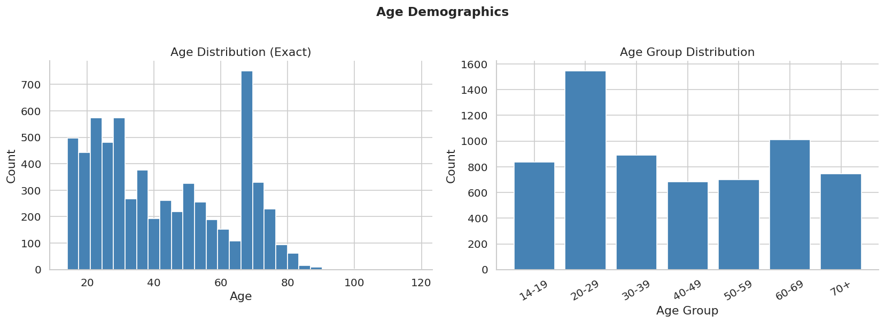

The 20–29 cohort dominates at ~24% of the sample. The distribution leans younger overall, with an anomalous spike near age 70 from the DDS sampling approach. This distribution sets the expectation that younger behavioral patterns will dominate averages — older segments require deliberate sub-analysis.

#### Block 3 — Demographic Overview

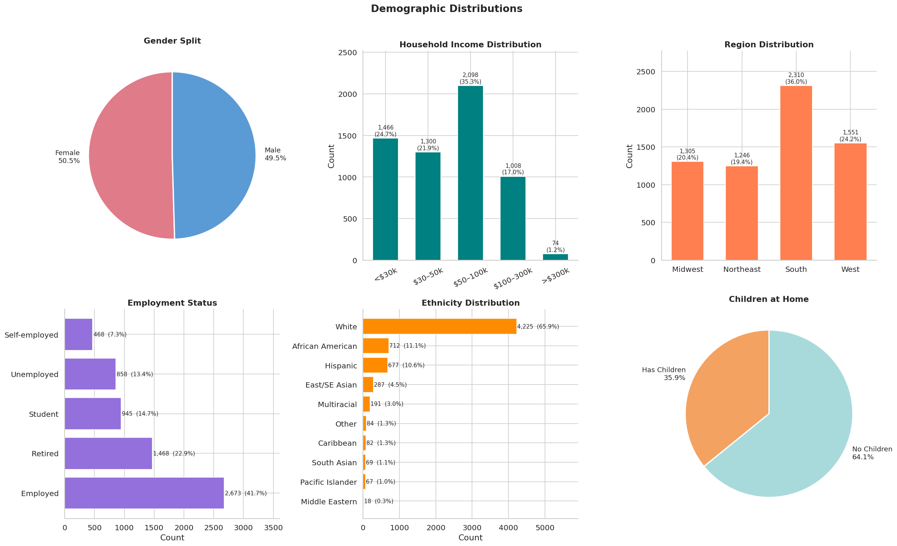

Near-even gender split (51% female, 49% male). Critically: **64% of respondents have no children at home**, which shifts product logic away from family bundles and toward individual convenience and personal entertainment.

#### Block 9 — Pay TV vs Streaming Adoption Over Time


The headline business finding. Pay TV declined from **~71% to ~65%** while streaming video grew from **~42% to ~52%** between 2015 and 2017. The trajectories are on a convergence path. This is not speculative — it is measured within the data.

#### Block 4 — Device Ownership Rates

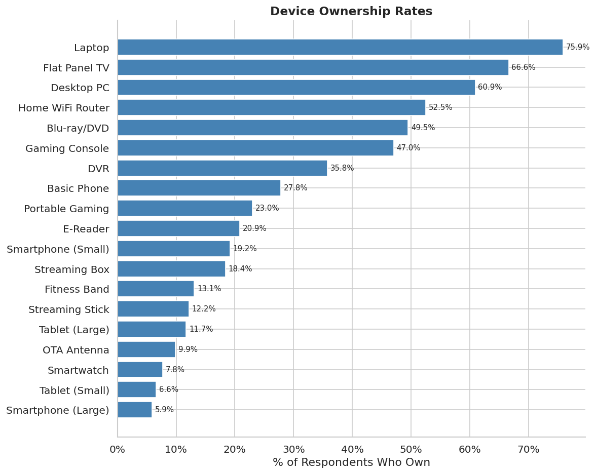

Laptops (78%), flat-panel TVs (89%), and home WiFi routers (82%) are near-universal. Streaming boxes reach 35%, smartwatches below 20%. The high-penetration devices are poor segmentation variables precisely because they're so common. Streaming boxes and gaming consoles, with more variance, proved to be strong predictors in the model.

#### Block 5 — Device Ownership by Age Group

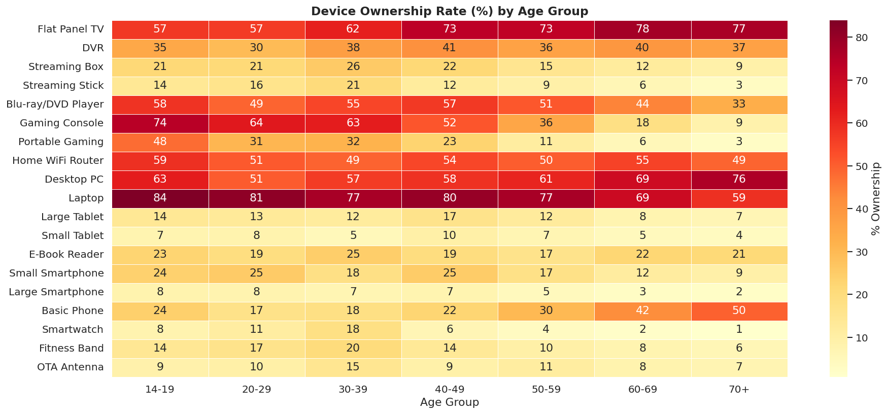

Gaming consoles are heavily favored by younger respondents. Desktop PCs and basic phones maintain stronger hold among older users. This heatmap directly informed the cluster personas built in Phase 3.

#### Block 6 — Media Consumption by Device

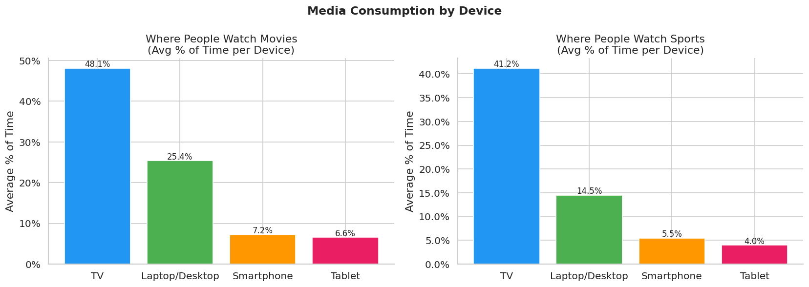

Television remains the primary screen for movie watching (**52% of total watch time**) and sports (**67%**). Laptops are a meaningful secondary screen for movies but not sports (live events favor the largest available screen).

#### Block 7 — Movie Watching by Age Group

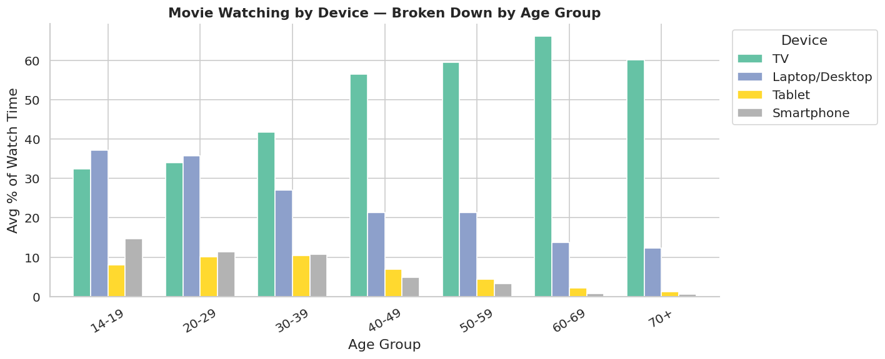

The most strategically important EDA chart. Among **14–19 year olds**, TV accounts for only ~25% of movie watch time. Among **60+ respondents**, TV accounts for over 74%. This generational split demands a dual-pronged product approach: mobile-optimized streaming for youth, intuitive Smart TV interfaces for older demographics.

#### Block 8 — Subscription Ownership Rates

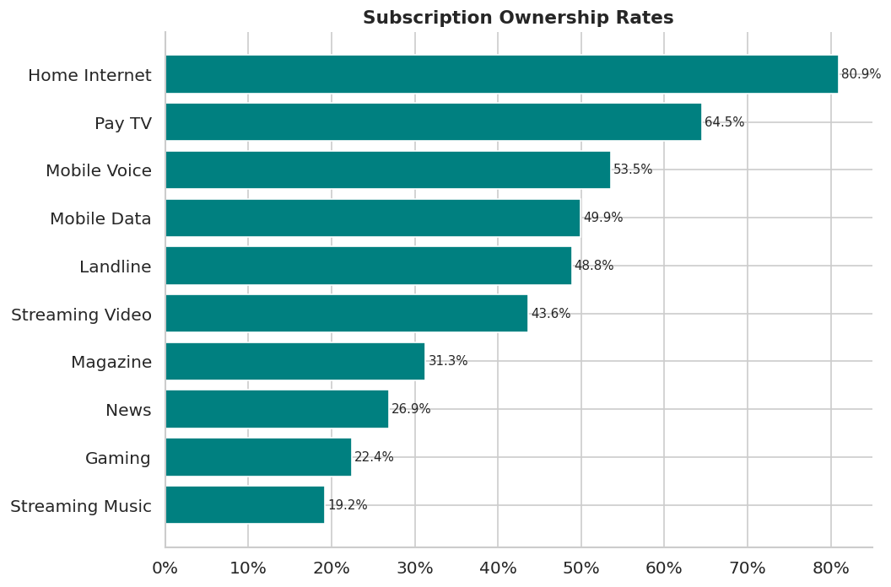

Home internet penetration at **81%** is the foundational access layer. The **33-point gap** between home internet and streaming video subscription quantifies the addressable market: the infrastructure is already there for most households. The conversion problem is not access — it is motivation and awareness.

#### Block 14 — Binge-Watching & Streaming by Demographics

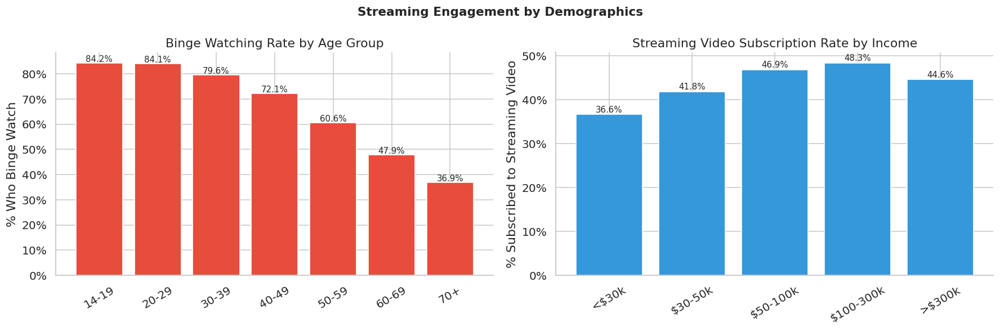

Binge-watching declines linearly with age: **84.2%** among teens → **36.9%** among the 70+ cohort. Streaming video subscription rates rise consistently with income: from **33%** in the under-$30k bracket to **69%** in the highest income tier. These findings directly informed the pricing and targeting strategy in Phase 5.

#### Block 13 — Demographics vs Entertainment Correlation

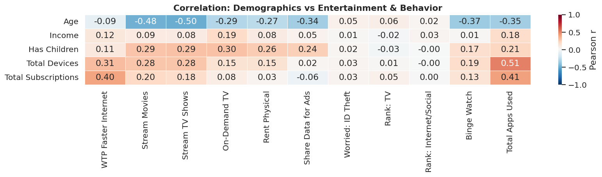

Age is the single strongest negative predictor of digital behaviors: **-0.50 correlation** with streaming TV shows, **-0.37** with binge-watching. Total subscriptions correlates positively with total devices owned (0.40) and total apps used (0.41) — users deeply embedded in the hardware ecosystem are far more likely to monetize through software subscriptions.

#### Block 17 — Full Numerical Correlation Heatmap

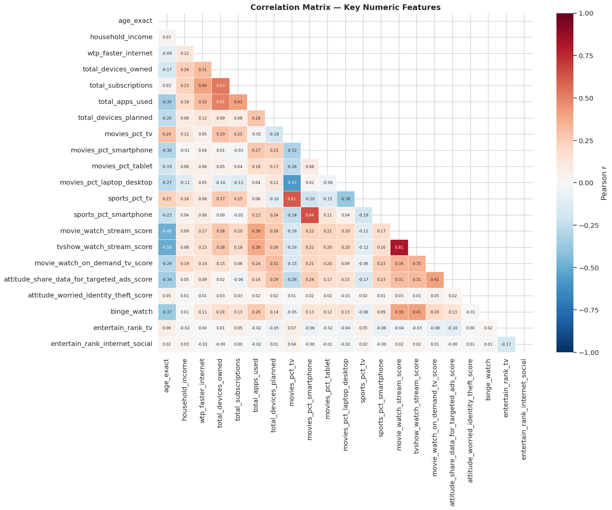

The **0.81 correlation** between streaming movies and streaming TV shows and **0.64** between sports on smartphone and sports on TV reveal strong ecosystem lock-in. From a modeling perspective, these flagged multicollinearity candidates. From a product perspective: if a user adopts a digital behavior on one device, they're highly likely to adopt it across their entire ecosystem.

---

### Phase 3 — Unsupervised Learning: K-Means Segmentation

#### Step 1 — Feature Selection

Selected only numeric columns (demographics, device ownership, app usage, WTP, media consumption percentages) and dropped rows with any remaining NaN.

**Why numeric only:** K-Means computes Euclidean distances. Mixed types (string + numeric) are mathematically incoherent for distance calculations.

#### Step 2 — Standardization + PCA Dimensionality Reduction

```python
scaler = StandardScaler()
X_scaled = scaler.fit_transform(features)

pca = PCA(n_components=0.90, random_state=42)
X_pca = pca.fit_transform(X_scaled)
```

**Why StandardScaler:** Without scaling, `age_exact` (range 14–80) would dominate `own_tv` (range 0–1) in Euclidean distance. Every binary feature would become noise.

**Why PCA at 90% variance:** 160+ features creates the Curse of Dimensionality — in high dimensions, all points become equidistant and K-Means loses its ability to separate clusters. PCA compresses the feature space while retaining 90% of the underlying consumer behavior patterns, stripping out multi-collinear noise.

#### Step 3 — Optimal k Selection

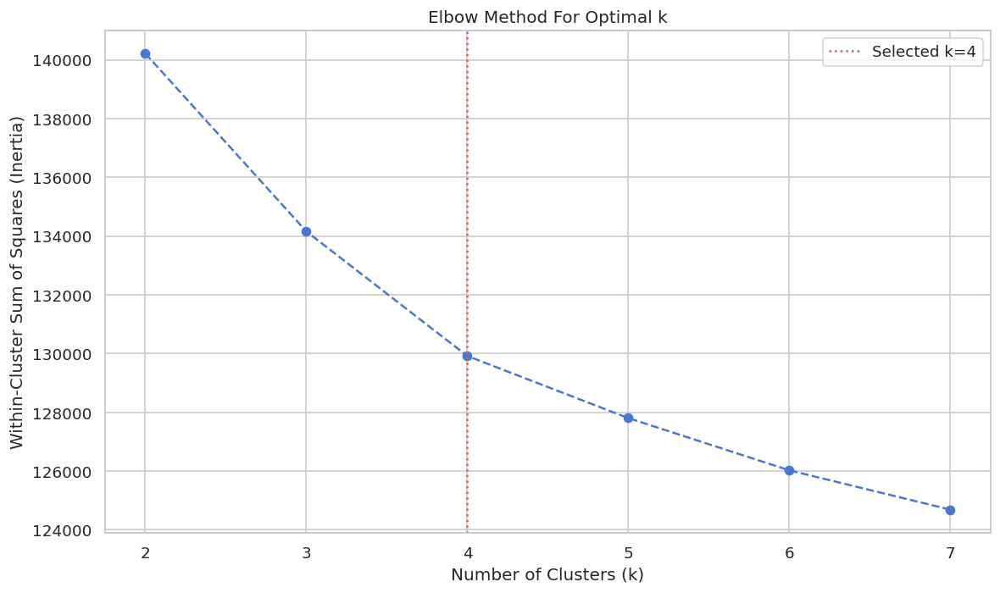

Evaluated K-Means for k=2 through k=7 using both WCSS (inertia) and Silhouette Score:

| k | Silhouette Score |
|---|---|
| 2 | 0.0782 |
| 3 | **0.0910** (statistical peak) |
| 4 | 0.0874 ← **selected** |
| 5 | 0.0721 |
| 6 | 0.0689 |
| 7 | 0.0650 |

**Why k=4 over k=3:** At k=3, the younger demographic collapsed into one group, obscuring the actionable behavioral difference between Mobile-First Minimalists (low-subscription, mobile-heavy) and Tech-Savvy Power Users (high-subscription, device-saturated). k=4 sacrifices 0.004 silhouette points in exchange for a cluster boundary that is highly meaningful for business strategy.

#### Step 4 — Cluster Profiles & Personas

| Persona | Size | Avg Age | Streaming Rate | Key Traits |
|---|---|---|---|---|
| **Mainstream Families** | 374 (33.8%) | 35 | **81.6%** | 6.5 devices, 5.6 subs, 69% Pay TV |
| **Traditionalist Retirees** | 404 (36.5%) | 58 | **30.4%** ⚠️ | 64.8% movies on TV, 1.6 apps (lowest) |
| **Mobile-First Minimalists** | 224 (20.2%) | 31 | **48.0%** | 43% movies on laptop, low subscription count |
| **Tech-Savvy Power Users** | 106 (9.6%) | 31 | **82.1%** | 9.6 devices, 14.7 apps (both highest) |

**The primary acquisition opportunity:** Traditionalist Retirees — the **largest segment (36.5%)** with the **lowest streaming rate (30.4%)**. 70% are non-subscribers. They already pay for entertainment (74% have Pay TV) — the barrier is not financial, it's familiarity.

---

### Phase 4 — Predictive Modeling: Streaming Subscription Classifier

**Business Question:** Can we predict whether a consumer will subscribe to streaming video based on their demographics, device ownership, app usage, and media consumption behavior?

**Target variable:** `sub_streaming_video` (binary: 1 = subscriber, 0 = non-subscriber)

#### Feature Leakage Prevention (Explicitly Documented)

Before any modeling, the following columns were explicitly excluded:

```python
exclude_cols = [
    'rank_sub_streaming_video',   # direct leakage — encodes how much they value their sub
    'rank_sub_streaming_music',   # proxy leakage
    'sub_pay_tv', 'sub_home_internet', 'sub_streaming_music', ...  # other subscription cols
    'total_subscriptions',        # aggregates target-related subs
    'survey_year',                # wave identifier, not a consumer feature
]
```

Also excluded columns with >40% nulls — too sparse for reliable imputation.

**Why this matters:** Including `rank_sub_streaming_video` would produce artificially inflated accuracy. The model would learn to identify existing subscribers rather than *predict future ones*. This is the most common and most costly mistake in binary classification on survey data.

#### Modeling Pipeline (Strict Anti-Leakage Sequence)

```
Stratified 80/20 split
    → Median imputation fitted on X_train only
    → StandardScaler fitted on X_train only
    → 5-fold cross-validation on training set
    → GridSearchCV tuning (RF + XGBoost only, by F1 score)
    → Test set evaluated ONCE at the end
```

**Why stratify=y:** Ensures the class proportion (subscriber/non-subscriber) is identical in both train and test — critical when classes are even slightly imbalanced.

**Why split before imputing:** If imputation is fitted on the full dataset, test-set statistics leak into training medians. The imputer MUST be fitted exclusively on X_train.

**Why SMOTE was skipped:** Target variable inspection confirmed near-balanced classes. The imbalance ratio was below 1.5× — SMOTE would introduce synthetic oversampling noise without addressing a real problem.

#### 5-Model Comparison (Cross-Validation)

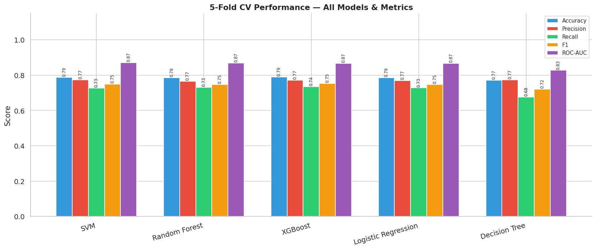

Five algorithms were trained, representing fundamentally different learning paradigms:
- **Logistic Regression** — Linear baseline, interpretable coefficients
- **Decision Tree** — Non-linear, fully interpretable rules, prone to overfitting
- **Random Forest** — Ensemble of 100s of decorrelated trees, reduces variance
- **XGBoost** — Gradient boosted trees, sequentially corrects prior tree errors
- **SVM (RBF kernel)** — Maximum-margin hyperplane, strong on non-linear separation

#### Hyperparameter Tuning (GridSearchCV)

Top 2 models by cross-validated ROC-AUC (Random Forest + XGBoost) were tuned:

```python
rf_param_grid = {
    'n_estimators': [100, 200, 300],
    'max_depth': [8, 10, 15, None],
    'min_samples_split': [2, 5, 10],
}
# GridSearchCV with 5-fold CV, scoring='f1'
```

**Why F1 as tuning metric (not accuracy):** F1 is the harmonic mean of Precision and Recall — it forces the model to do well on both, preventing the optimizer from gaining accuracy by simply predicting the majority class everywhere.

#### Final Test Set Results

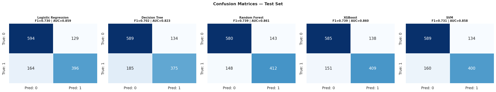

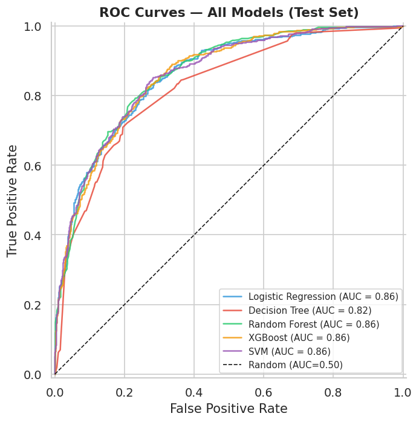

| Model | Accuracy | Precision | Recall | F1 | ROC-AUC |
|---|---|---|---|---|---|
| **Random Forest** ★ | 0.7732 | 0.7423 | 0.7357 | **0.7390** | **0.8612** |
| XGBoost | — | — | — | 0.7389 | 0.8596 |
| Logistic Regression | — | — | — | 0.7300 | 0.8587 |
| SVM | — | — | — | 0.7313 | 0.8582 |
| Decision Tree | — | — | — | 0.7016 | 0.8235 |

The tight clustering of the top four models within **0.003 AUC** of each other suggests the performance ceiling is imposed by the survey data itself — not by algorithm choice. Random Forest was selected for interpretability of feature importances and the marginal AUC lead.

#### Feature Importance

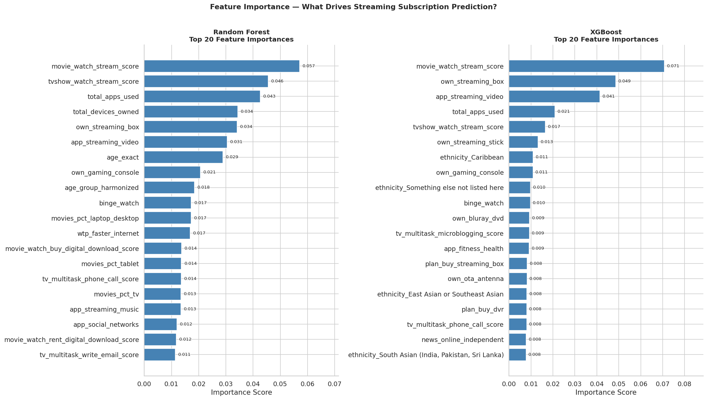

**Top predictors (Random Forest importance scores):**

| Feature | Importance | Business Interpretation |
|---|---|---|
| `movie_watch_stream_score` | 0.057 | Already streams informally → highest conversion readiness |
| `tvshow_watch_stream_score` | 0.046 | Already streams TV shows informally |
| `total_apps_used` | 0.043 | Digital fluency predicts subscription |
| `total_devices_owned` | 0.034 | Hardware investment = ecosystem commitment |
| `own_streaming_box` | 0.034 | Hardware ready, subscription missing → #1 targeting signal |
| `app_streaming_video` | 0.031 | Uses free tier → on-ramp to paid |
| `age_exact` | 0.029 | Only demographic in top 7 |
| `binge_watch` | 0.017 | Self-identified consumption style |
| `wtp_faster_internet` | 0.017 | Direct willingness to pay for digital services |

**Key insight:** The top 6 features are all **behavioral**, not demographic. Digital fluency (how many apps used, which devices owned, how frequently they stream informally) predicts subscription far better than age or income alone.

#### Partial Dependence Plots

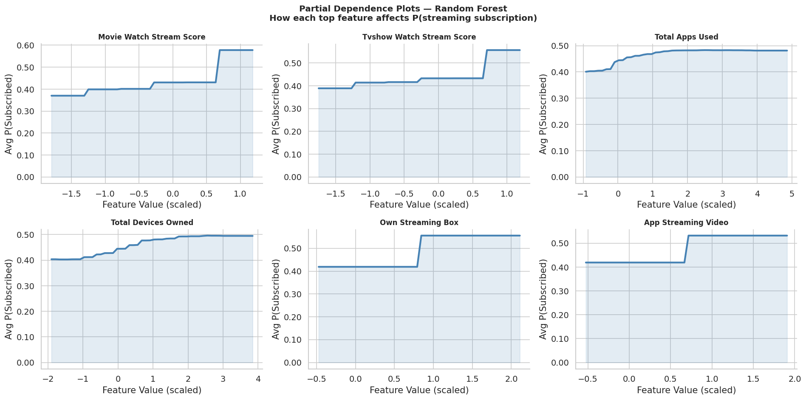

Manual PDP implementation (sklearn's built-in had XGBoost compatibility issues):

```python
def compute_pdp(model, X_df, feature, grid_resolution=50):
    grid = np.linspace(X_df[feature].min(), X_df[feature].max(), grid_resolution)
    avg_preds = [model.predict_proba(X_copy.values)[:, 1].mean()
                 for val in grid for _ in [X_copy.update({feature: val})]]
    return grid, np.array(avg_preds)
```

Plots show step-function jumps in subscription probability at specific feature thresholds — identifying exact **conversion tipping points** that marketing teams can use to time personalized upsell offers.

---

### Phase 5 — Business Insights via Google Gemini 2.5 Flash

Fed all quantitative outputs from Phases 3 and 4 into the Gemini LLM to generate qualitative strategic recommendations, using the **PAACB prompting framework** (Persona → Audience → Ask → Context → Boundaries) with `temperature=0` for determinism.

**4 LLM Tasks:**
1. **Executive Summary** — synthesized all findings into a C-suite deliverable
2. **Product Development Recommendations** — grounded in feature importances + cluster profiles
3. **Pricing Strategy** — grounded in WTP scores and cluster subscription rates
4. **Targeted Marketing Campaign Strategy** — acquisition priority ranking with behavioral conversion signals

---

## Key Findings

| # | Finding |
|---|---|
| 1 | Pay TV fell 71% → 65%, streaming grew 42% → 52% (2015–2017) — cord-cutting is measurable |
| 2 | 4 coherent consumer personas identified: Mainstream Families (81.6% streaming), Traditionalist Retirees (30.4%), Mobile-First Minimalists (48%), Tech-Savvy Power Users (82.1%) |
| 3 | Traditionalist Retirees = largest segment (36.5%) + lowest streaming rate = primary acquisition target |
| 4 | Behavioral signals outperform demographics: top 6 predictors are all behavioral, not demographic |
| 5 | `own_streaming_box` (importance 0.034): the clearest hardware gap signal — device is ready, subscription is missing |
| 6 | Random Forest: **ROC-AUC 0.861**, F1 0.739, Precision 0.742 — deployment-ready for propensity scoring |
| 7 | Age is the #1 demographic predictor and the single strongest negative correlate of digital consumption (-0.50 with streaming TV shows) |
| 8 | 33-point gap between home internet penetration (81%) and streaming subscription rate (48%) = addressable market of infrastructure-ready non-subscribers |

---

## Business Recommendations

*All recommendations traceable to specific cluster profiles or model feature importances.*

**1. Pay TV Bundle Conversion for Traditionalist Retirees**
Their 74% Pay TV rate is the highest of any cluster. Position streaming as an *add-on*, not a replacement — delivered via Pay TV commercial breaks and direct mail (their 1.6 average app usage confirms digital ads will miss this audience).

**2. Hardware Trigger Conversion**
Non-subscribers who own a streaming media box have completed every preparatory step except the subscription. Target with a 30-day free trial via device registration data or smart TV partnerships. `own_streaming_box` ranks 5th in feature importance (0.034).

**3. Deploy the Model as a Propensity Scoring Engine**
Retrain quarterly, score all non-subscribers by predicted subscription probability, and layer campaigns: high-propensity → acquisition ads; medium-propensity (free app users, `app_streaming_video = Yes`) → paywall nudge; low-propensity → brand awareness only. At Precision = 74.2%, model-targeted campaigns convert at a meaningfully higher rate than untargeted broadcast.

**4. Where *Not* to Spend Acquisition Budget**
Tech-Savvy Power Users (9.6% of market, 82.1% streaming rate) are effectively saturated. Mainstream Families (33.8%, 81.6%) are also largely converted. National campaigns ignoring the propensity model waste budget on already-subscribed consumers.

---

## Tech Stack

| Category | Tools |
|---|---|
| Language | Python 3 |
| Data manipulation | pandas, NumPy |
| Visualization | matplotlib, seaborn |
| Dimensionality reduction | sklearn.decomposition (PCA) |
| Unsupervised learning | sklearn.cluster (KMeans), sklearn.metrics (silhouette_score) |
| Supervised learning | sklearn (LogisticRegression, DecisionTreeClassifier, RandomForestClassifier, SVC), xgboost (XGBClassifier) |
| Model selection | GridSearchCV, StratifiedKFold, cross_validate |
| Evaluation | accuracy_score, precision_score, recall_score, f1_score, roc_auc_score, RocCurveDisplay |
| Imputation | sklearn.impute (SimpleImputer) |
| LLM | google-generativeai (Gemini 2.5 Flash) |
| Environment | Jupyter / Google Colab |

## Skills Demonstrated

**Data Engineering (Multi-wave Survey Pipeline):**
- Cross-wave column standardization via rename maps
- `pd.concat` with outer join for heterogeneous datasets
- Distinguishing structural vs random vs conditional missingness
- Six distinct null-handling strategies applied contextually (per variable)
- Sentinel value detection and replacement (-1 → 0)
- Cross-wave age harmonization using numeric age as common anchor
- Wave-split column consolidation
- Multi-rule feature dropping (sparsity thresholds with protected columns)
- Composite feature engineering (sum of binary flags)

**EDA:**
- 17 structured analytical blocks with stated business purpose
- Multi-subplot demographic profiling
- Heatmaps for two-dimensional breakdowns (device × age, app × age)
- Time-series subscription trend analysis
- Correlation matrices with business interpretation

**Unsupervised Learning:**
- PCA for dimensionality reduction with variance threshold
- Dual-metric k selection (WCSS + silhouette)
- Business-grounded k choice over statistical optimum
- Cluster profiling via group-level means
- Persona naming and narrative translation

**Supervised Learning:**
- Stratified train-test split
- Train-only imputation and scaling (anti-leakage pipeline)
- 5-model benchmark across different learning paradigms
- GridSearchCV with F1 scoring on top-2 models
- ROC-AUC + F1 as primary evaluation metrics
- Feature importance extraction and business translation
- Manual Partial Dependence Plot implementation

**LLM Integration:**
- PAACB prompting framework
- Quantitative context injection into prompts
- temperature=0 for determinism and reproducibility

## Repository Structure

```
├── notebooks/
│   └── DSDM_FinalProject_Code.ipynb
├── data/
│   ├── DDS9_Data_Extract_with_labels.xlsx     (if <100MB)
│   ├── DDS10_Data_Extract_with_labels.xlsx
│   └── DDS11_Data_Extract_with_labels.xlsx
├── visualizations/
│   ├── 02_age_distribution.png
│   ├── 03_demographics_grid.png
│   ├── 04_device_ownership.png
│   ├── 05_device_age_heatmap.png
│   ├── 06_media_by_device.png
│   ├── 07_movie_by_age.png
│   ├── 08_subscription_rates.png
│   ├── 09_paytv_vs_streaming_trend.png
│   ├── 13_demo_entertainment_corr.png
│   ├── 14_binge_and_streaming.png
│   ├── 17_full_corr_heatmap.png
│   ├── p3_01_elbow_silhouette.png
│   ├── p4_01_cv_performance.png
│   ├── p4_02_confusion_matrices.png
│   ├── p4_03_roc_curves.png
│   ├── p4_04_feature_importance.png
│   └── p4_05_pdp.png
├── requirements.txt
├── .env.example
└── README.md
```

## How to Reproduce

```bash
git clone https://github.com/JazimMehmoodQureshi/deloitte-digital-democracy-streaming.git
cd deloitte-digital-democracy-streaming
pip install -r requirements.txt

# Set up Gemini API key (Phase 5 only)
# 1. Get a key at https://aistudio.google.com
# 2. Copy .env.example to .env
# 3. Add:  GEMINI_API_KEY=your_key_here

jupyter notebook notebooks/DSDM_FinalProject_Code.ipynb
```

## Limitations

- Survey data from 2015–2017; streaming landscape has changed significantly since (Disney+, Apple TV+, COVID binge surge)
- k=4 chosen with deliberate balance between statistical criteria (silhouette peaked at k=3) and business interpretability — introduces more within-cluster variance than k=3 would
- SMOTE was not required but class balance was modest — a more imbalanced dataset would require resampling strategy review
- LLM outputs (Phase 5) are non-deterministic across API versions even at temperature=0

## Author

**Jazim Mehmood Qureshi** · BSc (Hons) Management Science, LUMS · [LinkedIn](https://linkedin.com/in/jazimmehmoodqureshi) · jazimmehmoodd@gmail.com